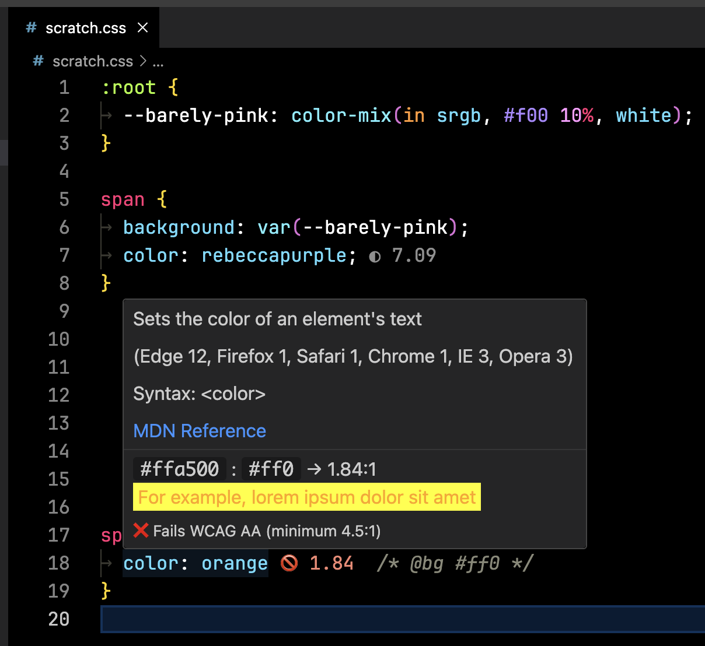

Show contrast hints in CSS files next to colors. Hover to get a preview.

The background is determined by `background-color` (or just `background` if it's a color) of the current rule,

To find the backgorund color, it'll check the current rule and walk up any nested rules. Custom properties can be defined in the `:root` selector.

You can force a background color without actually setting it by adding a comment like `/* @bg #f00 */`.

This'll never be perfect, because there's no way to know what a CSS rule is going to do outside the context of the HTML it's applied to, but this seems like a useful enough guess.
